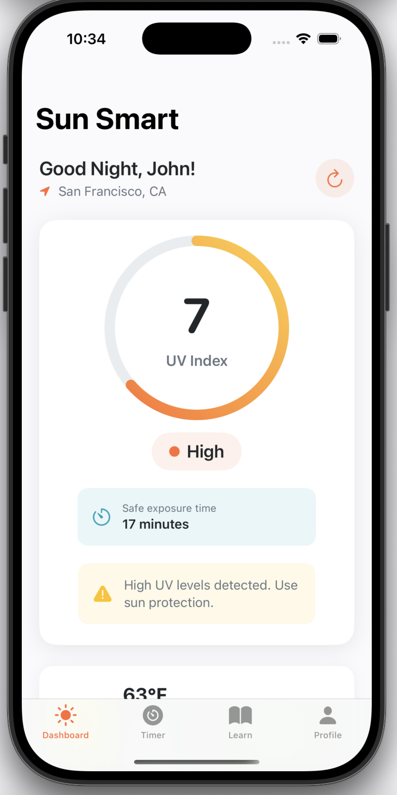
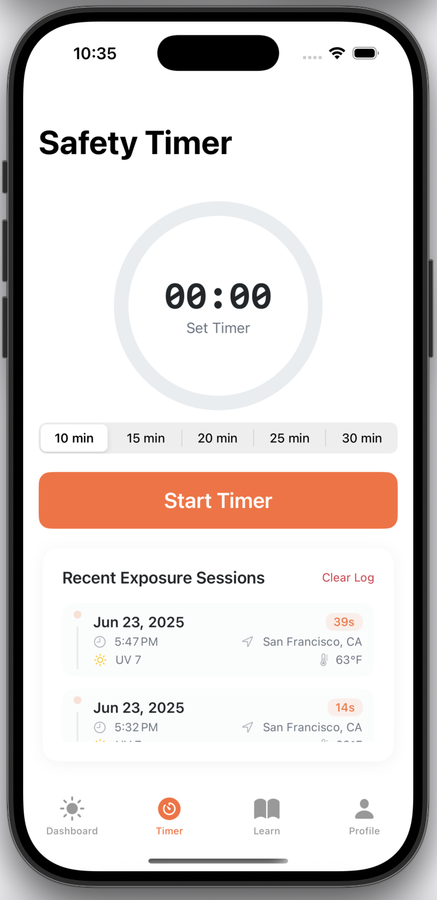
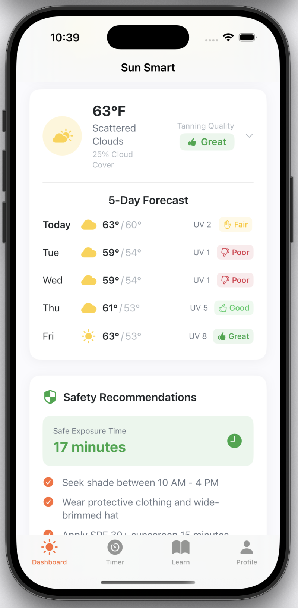
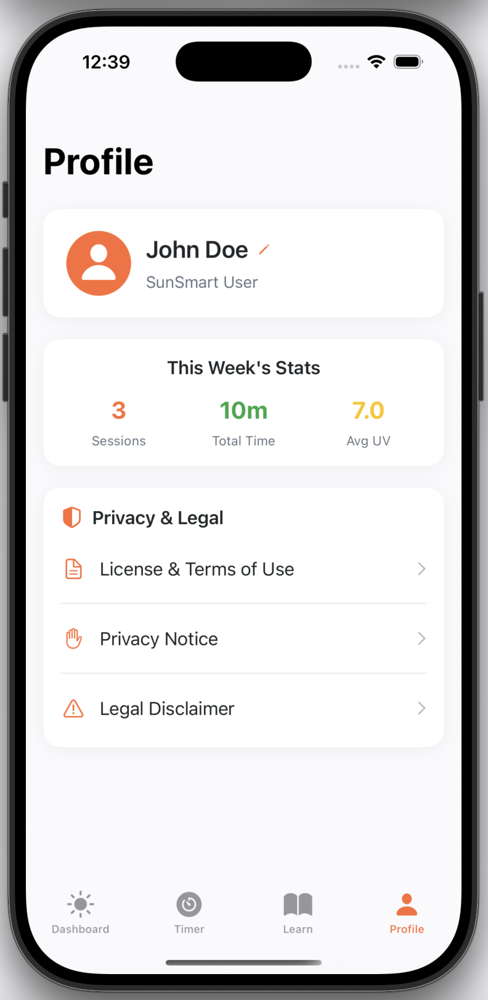

# Sunshade 🌞

A comprehensive iOS app for UV index monitoring and sun safety, built with SwiftUI. Sunshade helps users stay safe in the sun by providing real-time UV data, personalized recommendations, and exposure tracking.

## Features

### 🌡️ Real-Time UV Monitoring
- Live UV index data from OpenWeatherMap API
- Location-based weather information
- Current temperature and cloud cover
- Color-coded UV level indicators (Low, Moderate, High, Very High, Extreme)

### ⏰ Smart Safety Timer
- Customizable exposure timers (10-30 minutes)
- Visual countdown with circular progress indicator
- Automatic session logging when timer completes

### 📊 Exposure Activity Log
- Detailed tracking of sun exposure sessions
- Records duration, location, time of day, UV index, and temperature
- Timeline view showing most recent sessions first
- Persistent storage across app launches

### 🌤️ Interactive Weather Forecast
- Expandable 5-day weather forecast
- **Tanning Quality Indicators** - Smart recommendations based on UV index and cloud cover:
  - 🎯 **Great**: Perfect tanning conditions (UV 8+, low clouds)
  - 👍 **Good**: Good tanning weather (UV 5-7, some clouds)
  - 👌 **Fair**: Moderate conditions (UV 2-4, mixed clouds)
  - 👎 **Poor**: Not ideal for tanning (UV 0-1, heavy clouds)

### 🛡️ Personalized Safety Recommendations
- Safe exposure time calculations based on current UV index
- Dynamic safety tips and warnings
- SPF recommendations and reapplication reminders
- Shade-seeking advice during peak hours

### 👤 User Profile & Personalization
- Editable user name with personalized greetings
- Skin type selection for customized recommendations
- Weekly exposure statistics and session tracking
- Time-sensitive greetings (Good Morning/Afternoon/Evening)

### 🎯 Smart Dashboard
- Clean, intuitive interface with card-based layout
- Real-time location display with refresh capability
- UV index card with safe exposure time recommendations
- Daily progress tracking
- Pull-to-refresh functionality

## Screenshots

### Dashboard View


*Main dashboard showing UV index, weather conditions, and safety recommendations*

### Safety Timer


*Customizable safety timer with exposure session logging*

### Weather Forecast


*5-day forecast with tanning quality indicators*

### Profile View


*User profile with statistics and personalization options*

## Technical Features

### Architecture
- **MVVM Pattern**: Clean separation of concerns with ObservableObject view models
- **SwiftUI**: Modern declarative UI framework
- **Combine Framework**: Reactive programming for data flow
- **Core Location**: GPS-based location services

### APIs & Services
- **OpenWeatherMap API**: Real-time weather and UV data
- **Location Services**: Automatic location detection and reverse geocoding
- **UserDefaults**: Persistent storage for user preferences and exposure logs

### Data Models
- `WeatherData`: Comprehensive weather information with forecast data
- `ExposureSession`: Detailed session tracking with environmental context
- `UserProfile`: Personalized user settings and preferences
- `TanningQuality`: Smart quality assessment system

## Setup & Installation

### Prerequisites
- iOS 15.0+
- Xcode 14.0+
- OpenWeatherMap API key

### Configuration
1. Clone the repository
2. Open `Sunshade.xcodeproj` in Xcode
3. Add your OpenWeatherMap API key to `Configuration.swift`
4. Enable location permissions in your iOS simulator/device
5. Build and run the project

### API Configuration
```swift
// In Configuration.swift
static let openWeatherMapAPIKey = "YOUR_API_KEY_HERE"
```

Get your free API key from [OpenWeatherMap](https://openweathermap.org/api).

## App Structure

```
Sunshade/
├── Models/
│   ├── DashboardViewModel.swift    # Main app state management
│   ├── WeatherData.swift          # Weather and forecast models
│   ├── ExposureLog.swift          # Session tracking models
│   ├── UserProfile.swift          # User preferences
│   └── UVLevel.swift              # UV classification
├── Views/
│   ├── DashboardView.swift        # Main dashboard
│   ├── SafetyTimerView.swift      # Timer and activity log
│   ├── WeatherCard.swift          # Expandable weather forecast
│   ├── UVIndexCard.swift          # UV monitoring display
│   ├── ProfileView.swift          # User profile management
│   └── EducationView.swift        # Sun safety education
├── Services/
│   ├── WeatherService.swift       # API integration
│   └── LocationManager.swift      # GPS and location services
└── Utils/
    ├── AppColors.swift            # UI color scheme
    ├── TimeUtils.swift            # Time formatting utilities
    └── Configuration.swift        # App configuration
```

## Key Technologies

- **SwiftUI** - Modern declarative UI
- **Combine** - Reactive programming
- **Core Location** - GPS and geocoding
- **URLSession** - Network requests
- **UserDefaults** - Data persistence
- **Timer** - Background timing functionality


## License

This project is licensed under the MIT License - see the LICENSE file for details.

## Acknowledgments

- Weather data provided by [OpenWeatherMap](https://openweathermap.org/)
- UV safety guidelines from [WHO UV Index](https://www.who.int/news-room/q-a-detail/ultraviolet-(uv)-radiation)
- Built with ❤️ using SwiftUI

---
**Stay safe in the sun! ☀️🧴** 